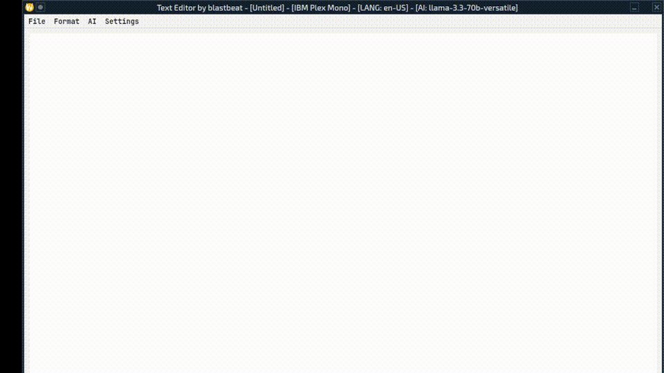

🇮🇹 Italiano | 🇬🇧 English (README.md)

# A1-Text

A1-Text è un text editor sperimentale scritto in Ruby e GTK4, ispirato a C1-Text per Amiga.

È progettato per rendere la digitazione più fluida e naturale possibile,
intervenendo **in tempo reale** sulla punteggiatura, sulla capitalizzazione
e sul flusso del testo, invece di correggere dopo.



## Filosofia del progetto

La maggior parte dei word processor moderni applica regole statiche
alla punteggiatura e alla digitazione.

PC-1-Text adotta un approccio diverso:
intercetta i tasti e il contesto mentre si scrive,
per adattare il comportamento del testo al flusso naturale della lingua.

Non è pensato per l’impaginazione,
ma per la scrittura narrativa e fluida.


## Funzionalità principali

### Scrittura e digitazione
- Punteggiatura automatica contestuale
- Capitalizzazione intelligente
- Gestione dei dialoghi con virgolette tipografiche
- Visualizzazione dei ritorni a capo

### Supporto alla scrittura
- Sostituzioni automatiche delle parole
- Completamento delle parole
- Controllo grammaticale (LanguageTool)

### Sistema
- Caricamento e salvataggio di testo normale (.txt)
- Autosave ogni 5 minuti
- Selezione dei font
- Suoni dei tasti

### Funzionalità opzionali
- Funzioni AI per migliorare il testo (disattivabili)

## Comportamento distintivo

### Punteggiatura intelligente

- Dopo i segni di punteggiatura viene inserito automaticamente uno spazio
- Dopo il punto (`.`) la parola successiva viene capitalizzata
- Se dopo un punto o una virgoletta di chiusura (`»`) si preme `Enter`,
  lo spazio viene automaticamente rimosso

Questo comportamento è pensato per facilitare
la scrittura di dialoghi e testo narrativo senza interrompere il flusso.

### Visualizzazione
I tasti Enter vengono visualizzati con un simbolo.

### Completamento parole
Per il completamento parola scorrere i suggerimenti del popover con i tasti freccia e premere il tasto TAB o cliccare col mouse per accettare. Il popover scomparirà automaticamente dopo 6 secondi o premendo il tasto ESC.

### Sostituzioni
Le parole vengono sostituite quando si preme il tasto "spazio". La tabella delle sostituzioni si trova nel file `replacement.txt`. È possibile aggiungerne altre secondo lo schema:

```
parola_da_sostituire <spazio> parola
```

## Dipendenze

### Software richiesto
- Ruby 3.4
- GTK4
- LanguageTool
- Java (necessario per lanciare il server LanguageTool)

### Gemme Ruby
- `gtk4`
- `thread`
- `net/http`
- `json`
- `open3`
- `httpx`
- `yaml`
- `gosu`

### API per funzionalità AI
Per le funzionalità AI occorre una API scaricabile gratuitamente dal sito https://groq.com/ e inserirla nel file `config.yml` insieme al modello desiderato (default: llama-3.3-70b-versatile)

## Installazione

### Installazione delle gemme in locale con Bundler

Aggiungere queste righe al file `.bashrc`:

```bash
export GEM_HOME="$HOME/.gem"
export GEM_PATH="$GEM_HOME:/percorso/delle proprie/gemme/di sistema"
export PATH="$HOME/.gem/bin:$PATH"
```

Da terminale, nella stessa cartella del programma e del file `Gemfile`, dare il comando:

```bash
bundle install
```
### Font
Copiare i font imclusi nella cartella `~/.fonts`

### Configurazione LanguageTool

Il programma cerca LanguageTool in `/usr/share/languagetool` e imposta la lingua a `en-US` Qualora il percorso di installazione nella vostra distribuzione sia diverso e/o desiderate una lingua diversa, modificate le relative voci nel file `config.yml`. Se necessario è possibile modificare anche il numero della porta del server.

## Configurazione

### Cursore a blocco in modalità insert

Per avere un cursore a blocco in modalità insert, modificare o aggiungere questa linea al file `settings.ini` in `~/.config/gtk-4.0`:

```ini
gtk-cursor-aspect-ratio=0.5
```

Il valore 0.5 determina lo spessore del cursore.

### Miglioramento dei font

Aggiungere queste impostazioni (se non presenti) per migliorare i font:

```ini
gtk-hint-font-metrics=1
gtk-xft-antialias=1
gtk-xft-hinting=1
gtk-xft-hintstyle=hintslight
gtk-xft-rgba=rgb
```

### Wayland e dead keys

Su Wayland, se si usa un layout di tastiera che utilizza i "dead keys" (es. USA Internazionale) e questi non dovessero funzionare, provare a installare `ibus`.

## Struttura del progetto

Il repository contiene:

- **Font inclusi**: IBMPlexMono-Regular, JetBrainsMono-Regular, Prototype, Topaz_a1200_v1.0
- **File di configurazione AI**: `robot.txt` e `ai.txt` per il controllo dei bot di intelligenza artificiale
- **Tabella sostituzioni**: `replacement.txt` per la sostituzione automatica delle parole
- **Configurazione**: `config.yml` per le impostazioni del programma
- **File Audio**: `click.wav` e `click2.wav`

## Licenza

Questo software è rilasciato sotto una **licenza custom source-available**
(**LicenseRef-blastbeat-NC-NoAI-CodebergRef-2025**).

 **Questo progetto NON è Open Source secondo la definizione dell’Open Source Initiative (OSI).**

Caratteristiche principali della licenza:

- **Uso non commerciale**:  
- **No AI / Machine Learning**:  
- **Codeberg come piattaforma di riferimento**:  

Copyright © 2025 blastbeat

Per i termini completi e legalmente vincolanti, consultare i file:
- `LICENSE`
- `LICENSE.spdx`

## Note di progettazione

Le scelte progettuali e le motivazioni sono documentate in [`DESIGN.md`](DESIGN.md).

## Stato del progetto

A1-Text è un progetto personale sviluppato nel tempo libero.

Gli aggiornamenti possono essere irregolari e non esiste una roadmap pubblica.
Segnalazioni e feedback sono benvenuti, ma senza aspettative su tempi o supporto.

